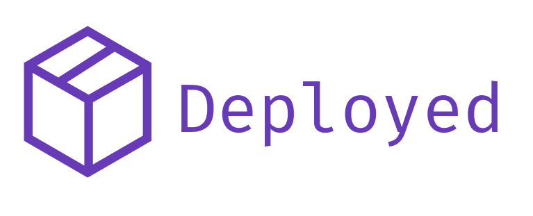

Deployed is a full stack web application designed to make management of personal projects
a breeze. The system tracks various applications and is able to pull, build, and deploy the
code to a personal server. Nginx configuration and SSL certificate generation are handled in
the background. Deployed uses Google for authentication to ensure that only the allowed users
can see and modify deployments.

---

## Tech Stack

**Frontend**: Angular

**Backend**: Go

**Data storage**: Firebase